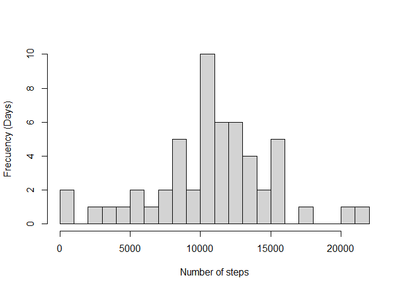
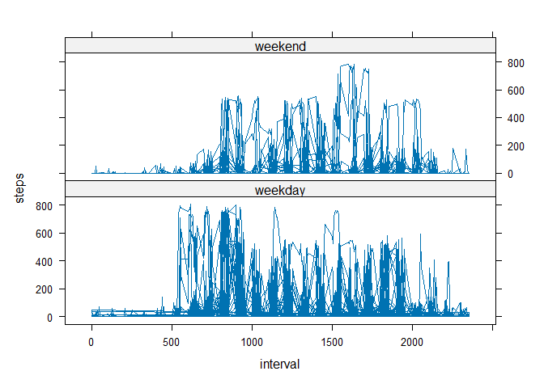

## Loading and preprocessing the data

Download the dataset [from this link](https://d396qusza40orc.cloudfront.net/repdata%2Fdata%2Factivity.zip) and unzip it into the working directory of R.

Read the data set and convert the date variable to date:


``` r
data.activity<- read.table("activity.csv", header = T, sep = ",",na.strings = "NA")
data.activity$date <- as.Date(data.activity$date)
head(data.activity)
```

```
##   steps       date interval
## 1    NA 2012-10-01        0
## 2    NA 2012-10-01        5
## 3    NA 2012-10-01       10
## 4    NA 2012-10-01       15
## 5    NA 2012-10-01       20
## 6    NA 2012-10-01       25
```

## What is mean total number of steps taken per day?

Sum the number of steps taken per day and plot it in a hist:


``` r
daily.steps <- aggregate(steps~ date,data = data.activity, FUN = sum )
length(daily.steps$date)# Days with measured steps
```

```
## [1] 53
```

``` r
hist( daily.steps$steps, ylab = "Frecuency (Days)",xlab= "Number of steps", main = "", breaks = 30)
```

<!-- -->

``` r
mean(daily.steps$steps, na.rm = T)
```

```
## [1] 10766.19
```

``` r
median(daily.steps$steps, na.rm = T)
```

```
## [1] 10765
```

The mean and median of steps per day was 1.0766189\times 10^{4} and 10765 , respectively.

## What is the average daily activity pattern?

Sum the number of steps taken each five minutes per day and plot it!


``` r
mean.pattern <- aggregate(steps~ interval,data = data.activity, FUN =function(x) mean(x, na.rm= T ))
mean.pattern[which.max(mean.pattern$steps),1]
```

```
## [1] 835
```

``` r
plot(mean.pattern, type ="l")
```

<!-- -->

835 was the 5-minute interval with the maximum number of steps, on average across all the measured days.

## Imputing missing values


``` r
summary(data.activity)
```

```
##      steps             date               interval     
##  Min.   :  0.00   Min.   :2012-10-01   Min.   :   0.0  
##  1st Qu.:  0.00   1st Qu.:2012-10-16   1st Qu.: 588.8  
##  Median :  0.00   Median :2012-10-31   Median :1177.5  
##  Mean   : 37.38   Mean   :2012-10-31   Mean   :1177.5  
##  3rd Qu.: 12.00   3rd Qu.:2012-11-15   3rd Qu.:1766.2  
##  Max.   :806.00   Max.   :2012-11-30   Max.   :2355.0  
##  NA's   :2304
```

The missing values just are in steps variable, there are 2304 missing values.

To impute these missing values, I will find the median of each interval and replace the missing values:


``` r
median.pattern <- aggregate(steps~ interval,data = data.activity, FUN =function(x) median(x, na.rm= T ))
```


``` r
data.activity.impute <- data.activity
for(i in median.pattern$interval){
  data.activity.impute$steps[is.na(data.activity.impute$steps) & data.activity.impute$interval==i] <- median.pattern[median.pattern[,1]==i,2]
}
summary(data.activity.impute)
```

```
##      steps          date               interval     
##  Min.   :  0   Min.   :2012-10-01   Min.   :   0.0  
##  1st Qu.:  0   1st Qu.:2012-10-16   1st Qu.: 588.8  
##  Median :  0   Median :2012-10-31   Median :1177.5  
##  Mean   : 33   Mean   :2012-10-31   Mean   :1177.5  
##  3rd Qu.:  8   3rd Qu.:2012-11-15   3rd Qu.:1766.2  
##  Max.   :806   Max.   :2012-11-30   Max.   :2355.0
```


``` r
daily.steps.imp <- aggregate(steps~ date,data = data.activity.impute, FUN = sum )

hist( daily.steps.imp$steps, ylab = "Frecuency (Days)",xlab= "Number of steps", main = "", breaks = 30)
```

<!-- -->

``` r
mean(daily.steps.imp$steps, na.rm = T)
```

```
## [1] 9503.869
```

``` r
median(daily.steps.imp$steps, na.rm = T)
```

```
## [1] 10395
```

The mean and median of steps per day with missing values imputed was 9503.8688525 and 10395 , respectively.

When comparing patterns, missing values may or may not introduce bias, depending on the question. In this case, imputing missing data based on the median might suggest that the person likely walked, on average, 9503.9 steps, not 1.07662\times 10^{4} steps.

## Are there differences in activity patterns between weekdays and weekends?


``` r
data.activity$weekend <- weekdays(data.activity$date)
data.activity$weekend[which(data.activity$weekend%in% c("sábado",    "domingo" ))] <- "weekend"
data.activity$weekend[which(data.activity$weekend !="weekend")] <- "weekday"
# mean by pattern in weekday or weekend
mean.pattern.weeknd <- aggregate(steps~ interval+weekend,data = data.activity, FUN =function(x) mean(x, na.rm= T ))

library(lattice)

xyplot(steps ~ interval | weekend,
       data = data.activity, type= "l",
       layout = c(1, 2)) 
```

<!-- -->

